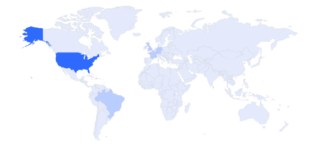
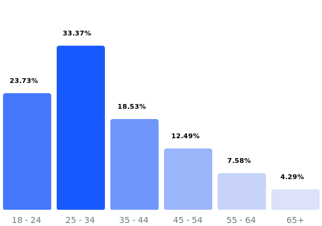

# Проектирование высоконагруженной платформы для управления проектами
Курсовая работа в рамках 3-го семестра программы по Веб-разработке ***Образовательного центра VK x МГТУ им.Н.Э.Баумана*** (ex. "Технопарк") по дисциплине "Проектирование высоконагруженных систем"

***Автор:*** Арзмасцев Артем ([Telegram](https://t.me/Gvidow), [VK](https://vk.com/gvidow))

---

#### Содержание:
1. [Тема, функционал и аудитория](#1)
2. [Список используемых источников](#2)
---

## Часть 1. Тема, функционал и аудитория

### Тема курсовой работы: ***"Проектирование платформы для управление проектами"***
В качестве примера выбран один из ведущих в мире сервисов управления проектами/тайм-менеджментом - [Trello](https://trello.com/)

### Ключевой функционал сервиса:
- Регистрация и авторизация пользователей;
- Создание контента с разграничениями прав пользования(доски);
- Возможность менять права доступа;
- Добавление и изменение статусов задач;
- Перемещение задач по доскам;
- Добавление комментариев к задачам

### Целевая аудитория:
По данным ***Similarweb[^1]***, аудитория Trello в мире составляет **83,2 млн человек** в месяц. 

#### Месячная и дневная аудитория Trello
- MAU: 83.2М
- DAU: 19М
- Среднее время проведенное в сервисе: 00:11:26
- Среднее количество просматриваемых страниц при посещении сервиса: 7.77

#### Соотношение пользователей по миру
По данным ***Similarweb[^1]***, самый большой процент аудитории 17.21% приходится на США

- Соединенные Штаты: 17.21%
- Бразилия: 13.76%
- Великобритания: 4.97%
- Германия: 3.39%
- Франция: 3.17%
- Другие: 57.5%

#### Соотношение пользователей по возрастам
- Преимущественно пользователи в возрасте 20-50 лет. Россия

- Женщины - 43.45%
- Мужчины - 56.55%

### Список используемых источников :
[^1]: [Аналитика Trello с Similarweb](https://www.similarweb.com/website/trello.com/#demographics)
